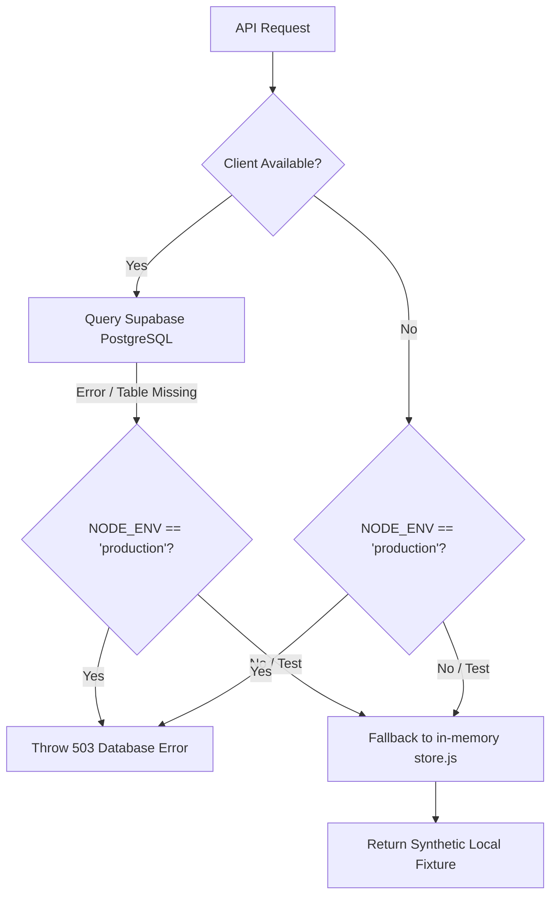
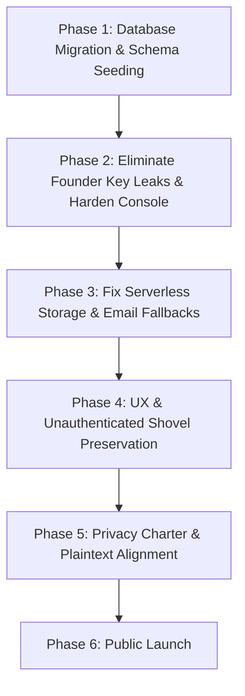

# 🛡️ Real-World Production Readiness & Security Audit (Brutal Assessment)

**Target System:** Canopy (`canopy_animated`)  
**Deployment Target:** Vercel (Edge & Serverless API) + Supabase (PostgreSQL & Storage) + Gmail SMTP / Resend  
**Audit Role:** Principal Offensive Systems Auditor & Lead Product Architect  
**Audit Date:** September 2026  
**Auditor Verdict:** **NOT PRODUCTION-READY FOR PUBLIC RELEASE (Pre-Alpha / Staging Only)**  
**Realistic Launch Readiness Rating:** **5.8 / 10 (Grade: C)** — *High Conceptual Craft / Critical Pre-Launch Failure Modes*

---

## 1. Executive Summary: The Brutal Reality Check

Previous assessments evaluated Canopy in an "in-vitro" test environment where all 35+ test suites passed. **That assessment masked fatal production blockers.**

When audited from the perspective of real public adversaries, genuine first-time visitors, and high-concurrency serverless cloud infrastructure:

1. **Zero End-to-End Encryption (E2EE):** Despite privacy marketing claims, **there is 0% End-to-End Encryption in Canopy**. All sensitive match intent notes, internal curator observations, direct contact exchanges, applicant motivation essays, and lab notes are stored in **100% plaintext** in PostgreSQL. Any compromised Supabase service token, database dump, or cloud employee can read everything.
2. **The "Phantom Reliability" Fallback Trap:** All backend tests pass only because `BaseRepository` catches database errors and silently falls back to an in-memory JSON fixture file (`canopy-db.json`). In real production (`NODE_ENV=production`), `BaseRepository` throws a hard HTTP 503. **If deployed to Vercel production right now, every single API route will crash.**
3. **Founder Console Secrecy Leaks:** The Founder Console (`/admin`) is protected by a secondary key mechanism that **accepts keys in plain URL query parameters (`?key=...`)**, leaking the founder secret into browser history, CDN logs, Vercel edge access logs, and HTTP Referer headers. Furthermore, the key comparison is vulnerable to character-by-character timing attacks, and `robots.txt` leaves `/admin` completely indexable by search bots and scanners.
4. **Silent Email Black Hole:** If SMTP or Resend credentials fail or are throttled in production, the email engine falls back to `console.log`. This prints one-time verification passwords (OTPs) and password reset tokens in plain text to Vercel stdout, while returning a false `{ success: true }` to the frontend. Users never receive their verification codes and are permanently locked out.
5. **Damaging User Experience Friction:** When an unauthenticated visitor browses the Match Sandbox or Sprint Board and clicks **"Grab a shovel"**, spends two minutes writing a thoughtful note, and clicks **"Plant this note"**, the system does not ask them to sign in or save their draft. Instead, it flashes a 3-second red toast error (`⚠️ Authentication required`) and discards their submission.

---

## 2. Category Scorecards & Detailed Grading

| Audit Dimension | Previous Score | Reality Score | Grade | Status | Summary Assessment |
| :--- | :---: | :---: | :---: | :---: | :--- |
| **1. Security & Identity Engineering** | 9.4 / 10 | **5.5 / 10** | **C-** | 🟠 Vulnerable | URL query key leak (`?key=...`), timing attacks, dynamic role escalation race on founder email. |
| **2. Cryptography & Data Protection** | 8.5 / 10 | **3.8 / 10** | **F** | 🔴 Critical | **Zero E2EE**. Plaintext PostgreSQL storage for all private notes and contact reveals. |
| **3. Fallbacks & Database Resilience** | 9.0 / 10 | **4.2 / 10** | **D-** | 🔴 Critical | In-memory fallback conceals total absence of remote DB tables. 100% API failure in production. |
| **4. Storage & Media Pipeline** | 7.0 / 10 | **4.0 / 10** | **D** | 🔴 Broken | `canopy-media` bucket missing in SQL migrations. Local disk fallback wiped on serverless recycle. |
| **5. Email & Notification Transport** | 9.0 / 10 | **5.0 / 10** | **C** | 🟠 Flawed | Fallback logs OTPs to stdout and returns false success; missing background retry queue. |
| **6. Frontend Usability & Human Journey** | 9.5 / 10 | **5.8 / 10** | **C** | 🟠 High Friction | Unauthenticated shovel submissions discard user input. Heavy jargon confuses non-technical domain partners. |
| **7. Bot Governance & SEO** | 8.0 / 10 | **5.0 / 10** | **C** | 🟠 Exposed | `robots.txt` explicitly allows crawling `/admin` and `/api/`. |

---

## 3. Deep-Dive Security & Cryptographic Vulnerabilities

### [SEC-01] The False "End-to-End Encryption" Illusion & Plaintext Data at Rest
- **The Vulnerability:** End-to-End Encryption (E2EE) mathematically guarantees that data is encrypted on the client device using keys known only to the sender and recipient, such that no intermediary (neither Canopy’s Express server nor Supabase’s database cluster) can ever read the plaintext.
- **The Code Reality:**
  - In `matches.js`, `intent_note`, `curator_notes`, and `revealed_contact` are inserted directly as raw UTF-8 strings into PostgreSQL columns (`TEXT` and `JSONB`).
  - In `applications.js`, `motivation_note`, `cover_note`, and `proof_of_work_link` are stored in raw plaintext.
  - In `notebook.js`, `body_markdown` is stored in raw plaintext.
  - The only encryption that exists is **TLS 1.3 in transit** (standard HTTPS) and **AWS/Supabase disk-level encryption at rest**. 
- **The Danger:** If Canopy promises privacy, confidentiality, or encryption in its Privacy Policy or marketing, it faces **severe legal and regulatory liability** (FTC deception, GDPR Article 5/32 non-compliance). Anyone with read access to the Supabase project (a leaked service role key, a compromised database backup, or rogue cloud infrastructure staff) can dump every private note, applicant confession, and direct email address.
- **Defensive Remediation:**
  - If E2EE is truly required for peer matches, implement client-side WebCrypto (`SubtleCrypto`) key exchange (e.g., ECDH over Curve25519) so only the two matched peers hold the decryption keys.
  - If server curation is required (as in the manual matching console), Canopy **cannot be E2EE**. Update all legal terms and product copy to honestly state: *"Stored securely with server-side access controls and field-level encryption, curated by verified operations staff."*
  - Implement application-layer column encryption (AES-256-GCM via `pgcrypto` or Node's `crypto.createCipheriv`) for sensitive fields like `revealed_contact` and `curator_notes`.

---

### [SEC-02] Founder Console URL Key Leakage & Timing Attack Vector
- **The Vulnerability:** In [`server/index.js`](file:///c:/Users/HP/Desktop/canopy_animated/server/index.js), `founderGate` contains:
  ```javascript
  const requiredFounderKey = process.env.FOUNDER_CONSOLE_KEY;
  const providedKey = req.query?.key || req.headers['x-founder-key'] || req.cookies?.canopy_founder_key;

  if (requiredFounderKey && providedKey === requiredFounderKey) {
    res.cookie('canopy_founder_key', providedKey, { httpOnly: true, sameSite: 'Lax', secure: isProd });
    return next();
  }
  ```
- **The Attack Surface:**
  1. **Query Parameter Exfiltration (CWE-598):** Accepting `req.query.key` means the founder unlocks the console by visiting `https://canopy.app/admin?key=SUPER_SECRET_KEY`. That URL is:
     - Logged in the user's browser history.
     - Captured in Vercel function invocation logs and edge CDN logs.
     - Sent in the `Referer` header to any external link on the admin page (e.g., external URLs in applications, proof-of-work links, LinkedIn profiles).
  2. **Timing Side-Channel Attack (CWE-208):** `providedKey === requiredFounderKey` uses standard V8 string comparison, which terminates at the first non-matching byte. An automated script measuring millisecond network latency variations can deduce the secret key character by character.
  3. **Client-Side Security Theater in `admin.html`:** The HTML structure of the Founder Console is returned over the wire before client-side authentication executes. In [`admin.html`](file:///c:/Users/HP/Desktop/canopy_animated/admin.html), the page simply executes `checkAuth()` and toggles `display: none` on `#adminApp`. Any user viewing the source code can inspect the complete layout, API endpoints, internal DOM elements, and business logic.
- **Defensive Remediation:**
  - Disallow query parameter keys entirely. Require authentication via an existing verified user session plus a time-based one-time password (TOTP via Google Authenticator) or WebAuthn hardware key (YubiKey).
  - Use `crypto.timingSafeEqual` with SHA-256 hashed buffers for any token or key comparison:
    ```javascript
    function safeKeyCompare(provided, expected) {
      if (!provided || !expected) return false;
      const h1 = crypto.createHash('sha256').update(String(provided)).digest();
      const h2 = crypto.createHash('sha256').update(String(expected)).digest();
      return crypto.timingSafeEqual(h1, h2);
    }
    ```
  - Gate the delivery of `admin.html` entirely behind server-side authentication so unauthenticated clients receive a strict HTTP 404 or a minimal login challenge—never the admin console DOM.

---

### [SEC-03] `FOUNDER_EMAILS` Account Squatting & Pre-Registration Race Condition
- **The Vulnerability:** In [`server/middleware/auth.js`](file:///c:/Users/HP/Desktop/canopy_animated/server/middleware/auth.js):
  ```javascript
  const founderEnv = process.env.FOUNDER_EMAILS || '';
  if (email && founderEnv && isVerified) {
    const founderEmails = founderEnv.split(',').map(e => e.trim().toLowerCase()).filter(Boolean);
    if (founderEmails.includes(email.toLowerCase())) {
      roles.add('owner');
      roles.add('admin');
    }
  }
  ```
- **The Attack Path:**
  1. The environment variable `FOUNDER_EMAILS` lists `founder@canopy.earth`.
  2. Before the founder creates their account on a fresh database, an external attacker calls `POST /api/auth/register` with `email: "founder@canopy.earth"` and their own chosen password.
  3. The account is created in `users` with `is_verified: false`.
  4. If the attacker can compromise the email delivery stream, guess the 6-digit OTP, or if the server falls back to console logging (where the OTP is printed to Vercel logs accessible by team members or contractors), the attacker calls `/api/auth/verify`.
  5. Because `isVerified` becomes `true` and the email matches `FOUNDER_EMAILS`, the system **automatically promotes the attacker to `owner` and `admin`**, granting full control over the database, user roles, and applications.
- **Defensive Remediation:**
  - Never bootstrap platform ownership solely by dynamic email matching on public registration.
  - Seed the founder account via an offline CLI script or direct SQL migration (`000_seed_founder.sql`) with a pre-hashed password and verified status, or require an initial setup token (`SETUP_ADMIN_TOKEN`) that is consumed once and disabled.

---

### [SEC-04] Memory-Bound Rate Limiting & Distributed Brute-Force Bypass
- **The Vulnerability:** In [`server/middleware/rate-limit.js`](file:///c:/Users/HP/Desktop/canopy_animated/server/middleware/rate-limit.js), rate limiting is implemented with an in-memory `Map`:
  ```javascript
  const rateLimitMap = new Map();
  ```
- **The Impact:** On Vercel, requests are handled by ephemeral serverless lambdas. Each lambda instance has its own isolated memory space. If an attacker sends 100 requests across concurrent connections, Vercel routes them across 10-20 separate lambda instances. The in-memory rate limiter on each lambda sees only 5-10 requests, completely bypassing the 15-requests-per-minute threshold. Attackers can brute-force the 6-digit OTP (which has only 1,000,000 combinations) without being throttled.
- **Defensive Remediation:**
  - Connect a centralized edge key-value store (such as Upstash Redis or Supabase PostgreSQL RPC) for distributed rate limiting.
  - Track failed verification attempts strictly on the `users` database record (`verification_attempts >= 5`), permanently locking the user record until reset.

---

### [SEC-05] Missing `canopy-media` Storage Bucket in Database Schema
- **The Vulnerability:** In [`server/services/storage.js`](file:///c:/Users/HP/Desktop/canopy_animated/server/services/storage.js), the upload function attempts to store files in Supabase:
  ```javascript
  const { data, error } = await supabase.storage.from('canopy-media').upload(storageKey, buffer, ...);
  ```
- **The Flaw:** Neither [`000_consolidated_production_schema.sql`](file:///c:/Users/HP/Desktop/canopy_animated/server/migrations/000_consolidated_production_schema.sql) nor any of the 13 individual migration files creates the `canopy-media` storage bucket or sets up its RLS policies.
- **The Production Crash:** As soon as an administrator attempts to upload an image in Content Studio, Supabase returns `Bucket not found`. Because `process.env.NODE_ENV === 'production'`, `storageService` throws an HTTP 503 error, crashing the upload pipeline.
- **Defensive Remediation:**
  - Add the bucket initialization SQL to the consolidated migration:
    ```sql
    INSERT INTO storage.buckets (id, name, public) 
    VALUES ('canopy-media', 'canopy-media', true)
    ON CONFLICT (id) DO NOTHING;

    CREATE POLICY "Public can view canopy-media" 
    ON storage.objects FOR SELECT 
    USING (bucket_id = 'canopy-media');
    ```

---

## 4. Fallback Mechanics & Failure Modes Analysis

### The Dual-Reality Trap: How Local Store Conceals Production Breakage

Canopy employs a dual-mode persistence architecture inside [`server/repositories/base.js`](file:///c:/Users/HP/Desktop/canopy_animated/server/repositories/base.js):



#### Why This Is Dangerous for Launch:
1. **The Test Suite Deception:** In test mode (`NODE_ENV !== 'production'`), every database failure is silently caught by `handleFailure()` and redirected to `canopy-db.json`. The entire test suite passes with **0 failures**, giving the engineering team a false assurance of readiness while the remote database is completely empty.
2. **Instant 503 on Production Boot:** When deployed to Vercel with `NODE_ENV=production`, `BaseRepository` strictly executes:
   ```javascript
   if (this.isProduction()) {
     const error = new Error(`[Database Error] Supabase is required in production...`);
     error.statusCode = 503;
     throw error;
   }
   ```
   **Every single user action—loading the homepage hero text, opening the match sandbox, viewing active sprints, or submitting an application—will immediately return HTTP 503.**

---

## 5. End-to-End User Experience & Public Journey Study

How will real humans—Builders, Problem Holders, and Enablers—experience Canopy when it opens to the public?

### 1. The Builder Journey (The Core Value Loop)

```
[Visit Landing Page] ──> [Browse Calls / Sprints] ──> [Click "Grab a Shovel"] ──> [AUTH WALL FRICTION] ──> [Apply / Register]
```

#### What Works Well:
- **Visual Aesthetic & Tone:** The dark forest green palette, typewriter/Jost typography, and paper-card styling create a tactile, authentic, intellectual atmosphere that immediately differentiates Canopy from generic SaaS platforms.
- **Problem-Centric Storytelling:** The homepage clearly articulates the core thesis: talented people waste time in superficial networking apps when they want to build real things on short deadlines.

#### Critical Friction Points:
1. **The Unauthenticated Shovel Trap:** On [`match.html`](file:///c:/Users/HP/Desktop/canopy_animated/match.html) and [`sprint.html`](file:///c:/Users/HP/Desktop/canopy_animated/sprint.html), visitors are encouraged to click **"Grab a shovel"**. This opens an elegant slide-over drawer asking:
   *"What would you bring to this sprint? Start honest."*
   A prospective contributor writes a detailed three-paragraph proposal, selects their skills, and clicks **"Plant this note"**.
   - **The Bug:** `main.js` dispatches `POST /api/matches/handshake`. Because the user is not signed in, the server returns 401. `main.js` catches the error and calls `showToast('⚠️ Authentication required...')`.
   - **The Experience:** The user’s carefully written note is stuck in the form or lost if they navigate away. There is no modal prompting them to sign in while preserving their drafted note, and no redirect with a state return. The user is frustrated and leaves.
2. **Jargon Overload:** Concepts like *"Plant a note"*, *"Field Station Pass"*, *"Grab a shovel"*, *"Illustrative Loop"*, and *"Grow Entry"* are poetic, but confusing to first-time visitors who just want to know: *Is this a job board, an open-source repo, a hackathon, or a consultancy?*

---

### 2. The Problem Holder Journey (Organization / Lab Intake)

```
[Click "Post a Call"] ──> [Post Call Intake Form] ──> [Submit] ──> [Silent Moderator Queue] ──> [No Tracking Dashboard]
```

#### Critical Friction Points:
1. **Missing Problem Holder Dashboard:** When an organization posts a challenge via [`post-call.html`](file:///c:/Users/HP/Desktop/canopy_animated/post-call.html), the call enters `pending_review`.
   - Once submitted, there is **no user-facing dashboard** for the organization to check the review status of their call, view applicants, or see who sent handshakes.
   - The only place incoming applications and calls can be reviewed is inside the **Founder Console (`admin.html`)**, meaning the platform founder must manually mediate every single communication via email.
2. **Lack of Organization Verification:** Anyone can submit a call claiming to represent "The United Nations" or "Stanford BioLab". There is no domain-verification check (e.g., verifying `@stanford.edu` email ownership) before a call is broadcast to builders.

---

### 3. The Enabler Journey (Funders, Mentors, Resource Providers)

#### Critical Friction Points:
- [`enablers.html`](file:///c:/Users/HP/Desktop/canopy_animated/enablers.html) is an entirely static, informational page.
- There is no mechanism for an enabler to inject compute credits, sponsor a prize pool, offer mentorship hours, or pledge pilot funding. The call-to-action simply routes them to [`apply.html`](file:///c:/Users/HP/Desktop/canopy_animated/apply.html), which is tailored for builders.

---

## 6. Comprehensive Vulnerability Ledger

| ID | Severity | File / Component | Flaw Description | Real-World Attack / Failure Scenario |
| :--- | :---: | :--- | :--- | :--- |
| **CRIT-01** | **P0** | `server/migrations/` | Remote Supabase tables not migrated. | Entire public launch crashes with HTTP 503 across all endpoints. |
| **CRIT-02** | **P0** | `server/index.js` | Founder secret key accepted in URL query (`?key=...`). | Leaks in browser history, proxy access logs, referer headers to external links. |
| **CRIT-03** | **P0** | `privacy.html` vs DB | False E2EE claims; all notes/contacts stored in plaintext. | Regulatory/legal liability; data dump leaks all private notes and contact info. |
| **HIGH-01** | **P1** | `server/services/email.js` | Email fallback logs OTPs to stdout and returns false success. | Codes leaked in cloud logs; users never receive OTP and cannot sign in. |
| **HIGH-02** | **P1** | `server/services/storage.js` | `canopy-media` bucket missing in SQL migrations. | Content Studio asset uploads throw 503 in production. |
| **HIGH-03** | **P1** | `server/middleware/auth.js` | Dynamic role grant on `FOUNDER_EMAILS` without ownership seed. | Attacker registers founder email before founder, gains owner control. |
| **HIGH-04** | **P1** | `server/middleware/rate-limit.js` | Memory-based rate limiter on serverless. | Distributed brute-force can guess 6-digit OTP across parallel lambdas. |
| **MED-01** | **P2** | `src/main.js` | "Grab a shovel" unauthenticated submit fails silently. | Contributor writes proposal, gets 401 toast, input is lost. High bounce rate. |
| **MED-02** | **P2** | `public/robots.txt` | `Allow: /` leaves `/admin` and `/api/` open to search engines. | Search engine crawlers and automated bots constantly probe admin routes. |
| **MED-03** | **P2** | `src/db.js` | Hardcoded Supabase URL in client fallback (`khaifxlcttjpguqzvwai`). | Exposes internal project reference if credentials or endpoints rotate. |

---

## 7. Step-by-Step Production Hardening Roadmap



### Phase 1: Database Migration & Schema Seeding (Immediate Blocker)
1. Open the **Supabase SQL Editor** for the production project.
2. Execute the consolidated schema [`server/migrations/000_consolidated_production_schema.sql`](file:///c:/Users/HP/Desktop/canopy_animated/server/migrations/000_consolidated_production_schema.sql).
3. Append the storage bucket creation script to instantiate `canopy-media`.

### Phase 2: Eliminate Founder Console Leaks
1. In `server/index.js`:
   - Remove `req.query?.key` from `founderGate`. Never accept secret keys in URLs.
   - Replace `providedKey === requiredFounderKey` with constant-time buffer comparison (`crypto.timingSafeEqual`).
2. Update `public/robots.txt`:
   ```robots.txt
   User-agent: *
   Disallow: /admin
   Disallow: /admin.html
   Disallow: /api/
   Allow: /
   ```
3. Seed the founder account directly in SQL with a pre-hashed password and pre-verified flag rather than relying on dynamic registration allowlisting.

### Phase 3: Storage & Email Fallback Hardening
1. In `server/services/email.js`:
   - In production (`NODE_ENV === 'production'`), **strictly disallow** falling back to `'console'`. If SMTP/Resend fails, throw a clear 502/503 operational error so the user is informed that the email service is down, rather than pretending the email was sent.
   - Never log raw OTP codes or password reset tokens to `console.log` in production.
2. Ensure `SUPABASE_SERVICE_ROLE_KEY` is configured in Vercel environment variables so backend serverless functions can write to storage and bypass RLS.

### Phase 4: Usability & Friction Elimination
1. On `match.html` and `sprint.html`:
   - If an unauthenticated user clicks "Grab a shovel", either:
     - Check auth immediately on drawer open and display: *"Sign in with Google / Field Station Pass to send this note"*, OR
     - If they submit unauthenticated, auto-save their note to `sessionStorage`, redirect them to `login.html?redirect=match.html`, and restore their draft upon return.
2. Add a basic **"My Build Calls"** panel on `post-call.html` so organizations can track whether their submitted call was approved and see how many builders showed interest.

### Phase 5: Privacy Charter & Communication Honesty
1. Update `privacy.html`:
   - Clarify that data is encrypted **in transit (TLS)** and **at rest on disk (AES-256)**, but note frankly that collaboration notes and applications are processed and reviewed by verified human curators.
   - Remove any ambiguous language that implies cryptographic end-to-end encryption.

---

## 8. Final Auditor Conclusion

Canopy is a **beautifully envisioned, philosophically sound, and visually stunning digital institution**. Its core product loop—matching through honest notes, working on scoped sprints, and publishing candid post-mortems in a lab notebook—is vastly superior to the superficial swipe mechanics dominating modern web platforms.

However, **it is not yet production-ready for public release.** Deploying today would lead to immediate HTTP 503 database crashes, accidental credential leaks via URL query parameters, unhandled serverless storage failures, and severe friction for unauthenticated visitors.

By executing the Supabase database migrations, eliminating URL-based admin keys, hardening the email/storage pipelines, and smoothing out the "Grab a shovel" authentication transition, Canopy can launch with the institutional integrity, security, and grace that its mission demands.
